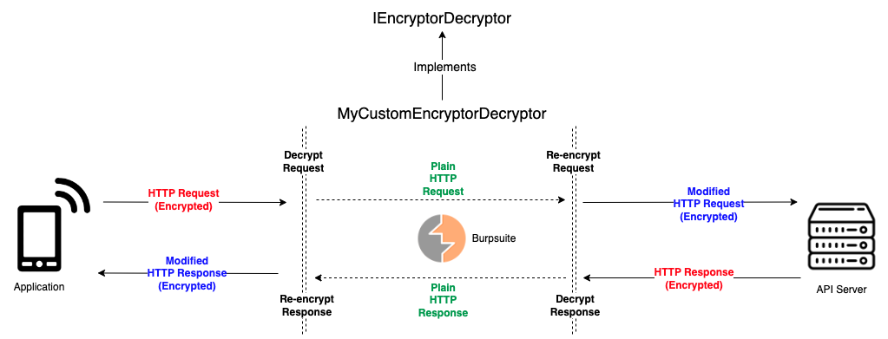
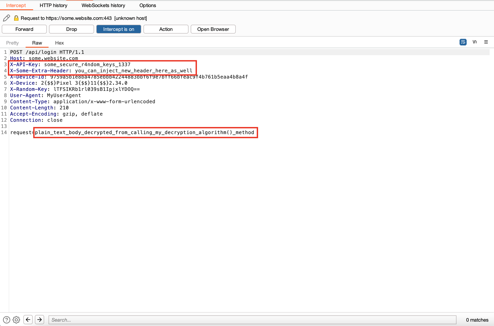

# Plainmaker: Burpsuite Plugin

<h4 align="center">A Programmable and Implementable AESKiller-like Burpsuite Extension<a href="https://github.com/chrisandoryan/Nethive-Project" target="_blank"></a></h4>

## Background
After some hours working to *reverse engineer* the encryption/decryption process of a mobile application, Jojo successfully comes up with a `crypt.py` script that allows him to generate a customized and encrypted HTTP requests and responses.

However, since <ins>it is a script</ins>, then Jojo must copy the values outputted by the script, paste it into Burpsuite, then send it away; like this:


Using <a href="https://github.com/Ebryx/AES-Killer" target="_blank">AESKiller</a> is also not an option because, for example: 
- The *mobile application* uses a customized AES encryption flow, with different key and IV for encrypting and decrypting HTTP requests and responses.
- Some operations (e.g., XOR) must be done to the key or IV  before it can be used in the encryption/decryption process.
- The key or IV is dynamically generated, or must be retrieved from somewhere in the HTTP request/response.
- Or perhaps, the *mobile application* simply does not use AES for its encryption/decryption process.

So, if sometimes in the future you find yourself suffering like Jojo, this repository might be for you.

## Features

- Provides a fully-customizable and implementable Interface class, named `IEncryptorDecryptor` for creating your own Burpsuite Plugin/Extension.
- `IEncryptorDecryptor` interface allows you to implement your custom encryption/decryption script and integrate them directly into Burpsuite requests and responses.
- Total control over the encryption/decryption flow and choice of algorithms (e.g. AES, RSA, DES, etc.).
- Written in Python/Jython 2.7.3 and easily integrated into your Burpsuite workflow.

## What It Does
In hindsight, this is similar to what AESKiller is doing:
- The IProxyListener decrypt requests and encrypt responses, and an IHttpListener than encrypt requests and decrypt responses.
- Burp sees the decrypted traffic, including Repeater, Intruder and Scanner, but the client/mobile app and server see the encrypted version.

However, there will be no static input boxes to insert an AES key and IV; you have the freedom to <ins>implement the flow of the encryption/decryption by yourself</ins>.

### Huh? Then?
Simply take your encryption/decryption script (like Jojo's `crypt.py`), then adjust it into a Python class that implements `IEncryptDecrypt` interface, and *voila*. **The encrypted/decrypted values will be injected into Burpsuite's requests/responses automatically.**

## How It Works



**Plainmaker** has 4-stage encryption/decryption interfaces that can be implemented and overridden in your own Python script.

| **Stage**              	| Interface Method                                       	| When to Implement?                                                                                                                        	|
|------------------------	|--------------------------------------------------------	|-------------------------------------------------------------------------------------------------------------------------------------------	|
| Request Decryption     	| `decrypt_http_request(original_request, iRequestInfo)`    	| When the HTTP request is encrypted and you want Burpsuite to display it in the decrypted format.                                                                            	|
| Request Re-encryption  	| `encrypt_http_request(original_request, iRequestInfo)`    	| When the decrypted HTTP request has been modified and you want to re-encrypt it so that it stays valid upon received by the server..      	|
| Response Decryption    	| `decrypt_http_response(original_response, iResponseInfo)` 	| When the HTTP response is encrypted and you want Burpsuite to display it in the decrypted format.                                                                           	|
| Response Re-encryption 	| `encrypt_http_response(original_response, iResponseInfo)` 	| When the decrypted HTTP response has been modified and you want to re-encrypt it so that it stays valid upon received by the application. 	|

### I get it. But what should I write in my Python script?

You have to create a Python class that implements `IEncryptorDecryptor` interface. Then, in most cases you will only need to override some of the 4 methods above according to your needs. 

```python
class MyCustomEncryptorDecryptor(IEncryptorDecryptor):
    # Overrides decrypt_http_request() from IEncryptorDecryptor interface
    def decrypt_http_request(self, original_request, iRequestInfo):
        req_body = IEncryptorDecryptor.get_http_body(original_request, iRequestInfo)
        key = "some_secure_r4ndom_keys_1337"
        IV = "some_secure_r4ndom_IV_1337"

        # Run your decryption algorithm workflow here
        # ...
        decrypted_body = my_decryption_algorithm(req_body, key, IV)

        # Should always return a dictionary containing 'headers' and 'body' attribute
        return {
            "headers": {
                "X-API-Key": key,
                "X-Some-Extra-Header": "you_can_inject_new_header_here_as_well"
            },
            "body": "request=%s" % decrypted_body
        }
```

Each of the methods you override should return a dictionary containing two attributes: **headers** and **body**. These attributes represent the HTTP headers and body that you want to add to the original request or response. 

Hence, when Burpsuite intercepts an HTTP request or response, it will insert the headers and body from your dictionary into the original request or response.




## Installation

## Contributors
