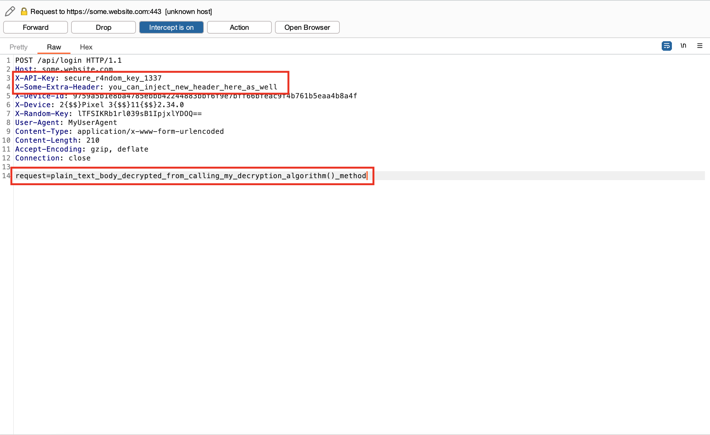

# Plainmaker: Burpsuite Plugin

<h4 align="center">A Programmable and Implementable AESKiller-like Burpsuite Extension<a href="https://github.com/chrisandoryan/Nethive-Project" target="_blank"></a></h4>

## Background
After some hours working to *reverse engineer* the encryption/decryption process of a mobile application, Jojo successfully comes up with a `crypt.py` script that allows him to generate a customized and encrypted HTTP requests and responses.

However, since <ins>it is a script</ins>, then Jojo must copy the values outputted by the script, paste it into Burpsuite, then send it away; like this:


Using <a href="https://github.com/Ebryx/AES-Killer" target="_blank">AESKiller</a> is also not an option because, for example: 
- The mobile application uses a unique AES encryption method that involves different keys and initialization vectors for encrypting and decrypting.
- Certain calculations (such as XOR) must be performed on the key or initialization vector before it can be used in the encryption/decryption process.
- The key or initialization vector is generated dynamically or must be obtained from somewhere within the HTTP request or response.
- The mobile application may not be using AES encryption/decryption at all.

So, if sometimes in the future you find yourself suffering like Jojo, this repository might be for you.

## Features

- Fully-customizable and implementable Interface class for creating your own Burpsuite Extension.
- Implement your custom encryption/decryption code and integrate them directly into Burpsuite requests and responses.
- Total control over the encryption/decryption flow and choice of algorithms (e.g. AES, RSA, DES, etc.).
- Written in Python/Jython 2.7.3.

## What It Does
In hindsight, this is similar to what AESKiller is doing:
- The IProxyListener decrypt requests and encrypt responses, and an IHttpListener than encrypt requests and decrypt responses.
- Burp sees the decrypted traffic, including Repeater, Intruder and Scanner, but the client/mobile app and server see the encrypted version.

However, there will be no static input boxes to insert an AES key and IV; you have the freedom to <ins>implement the flow of the encryption/decryption by yourself</ins>.

### Huh? Then?
Simply take your encryption/decryption script (like Jojo's `crypt.py`), then rewrite it into a Python class that implements `IEncryptDecrypt` interface, and *voila*. **The encrypted/decrypted values will be injected into Burpsuite's requests/responses automatically.**

## How It Works


**Plainmaker** has 4-stage encryption/decryption interfaces that can be implemented and overridden in your own Python script.

| **Stage**              	| Interface Method                                       	| When to Implement?                                                                                                                        	|
|------------------------	|--------------------------------------------------------	|-------------------------------------------------------------------------------------------------------------------------------------------	|
| Request Decryption     	| `decrypt_http_request(original_request, iRequestInfo)`    	| When the HTTP request is encrypted and you want Burpsuite to display it in the decrypted format.                                                                            	|
| Request Re-encryption  	| `encrypt_http_request(original_request, iRequestInfo)`    	| When the decrypted HTTP request has been modified and you want to re-encrypt it so that it stays valid upon received by the server..      	|
| Response Decryption    	| `decrypt_http_response(original_response, iResponseInfo)` 	| When the HTTP response is encrypted and you want Burpsuite to display it in the decrypted format.                                                                           	|
| Response Re-encryption 	| `encrypt_http_response(original_response, iResponseInfo)` 	| When the decrypted HTTP response has been modified and you want to re-encrypt it so that it stays valid upon received by the application. 	|

The methods above receive two (2) parameters by design, `original_request` or `original_response` and `iRequestInfo` or `iResponseInfo`.

**original_request: string**

A parameter that contains the original HTTP request in Python string format.

**original_response: string**

A parameter that contains the original HTTP response in Python string format.

**iRequestInfo: object** 

A parameter that contains Burp interface object used to retrieve key details about the HTTP requests. See [iRequestInfo](https://portswigger.net/burp/extender/api/burp/irequestinfo.html) for more information.

**iResponseInfo: object** 

A parameter that contains Burp interface object used to retrieve key details about the HTTP responses. See [iResponseInfo](https://portswigger.net/burp/extender/api/burp/iresponseinfo.html) for more information.

## Quick Start (Example)

You have to create a Python class that implements `IEncryptorDecryptor` interface. Then, in most cases you will only need to override some of the 4 methods above according to your needs. 

Here is an implementation example to decrypt every HTTP request using static key (`secure_r4ndom_key_1337`) and IV (`secure_r4ndom_IV_1338`) and calling a user-defined function named `my_decryption_algorithm()`:

```python
class MyCustomEncryptorDecryptor(IEncryptorDecryptor):
    
    # Overrides decrypt_http_request() from IEncryptorDecryptor interface
    def decrypt_http_request(self, original_request, iRequestInfo):
        
        # Get the original HTTP request body
        req_body = IEncryptorDecryptor.get_http_body(original_request, iRequestInfo)
        key = "secure_r4ndom_key_1337"
        IV = "secure_r4ndom_IV_1338"

        # Run your decryption algorithm workflow here
        # ...
        decrypted_body = my_decryption_algorithm(req_body, key, IV)

        # Should always return a dictionary containing 'headers' and 'body' attributes
        return {
            "headers": {
                "X-API-Key": key,
                "X-Some-Extra-Header": "you_can_inject_new_header_here_as_well"
            },
            "body": "request=%s" % decrypted_body
        }
```

 In a nutshell, **Plainmaker** works by injecting your modified HTTP headers and HTTP body into Burpsuite. Henceforth, each of the above methods you override should return a `dictionary` containing two attributes: **headers** and **body**. These attributes represent the HTTP headers and body that you want to add to the original request or response. 

Thus, when Burpsuite intercepts an HTTP request or response, it will insert/update the headers and body from your dictionary into the original request or response.



## Installation
### 1. Building the Plainmaker Extension
In essence, there are two (2) "**TODO:**" marks that we have put into the `plainmaker.py` source code in this repository, indicating sections of code that you need to write/customize by yourself. Before installing the plugin into Burpsuite, you have to visit both sections and write your changes there.

**A. Write and implement your own encryptor-decryptor class.**
```python
#####################################################################
# TODO: Write and implement your own encryptor-decryptor class here.
#####################################################################

class MyCustomEncryptorDecryptor(IEncryptorDecryptor):
    def __init__(self):
        super().__init__()

    def encrypt_http_request(self, original_request, iRequestInfo):
        return {
    
    # ...
```

In this **TODO:** section, you need to create a new Python class that implements `IEncryptorDecryptor` interface.

After that, according to your needs, you might want to override any of the following available methods according to your needs: 
- `decrypt_http_request()`
- `decrypt_http_response()`
- `encrypt_http_request()`
- `encrypt_http_response()`

In each of those methods, implement the encryption/decryption code that fits the cryptographic operation of your application, then return a `dictionary` object containing two attributes: **headers** and **body**. The returned values will be injected into Burpsuite when it displays the intercepted HTTP requests or responses.

*See [samples](https://github.com/chrisandoryan/Plainmaker/tree/main/samples) directory for detailed examples.*

**B. Create a new instance of your encryptor-decryptor class.**
```python
class BurpExtender(IBurpExtender, IHttpListener, IProxyListener):
    HTTP_HANDLER = 0
    PROXY_HANDLER = 1

    def __init__(self):
        # TODO: Create a new instance of your encryptor-decryptor class here.
        encdec = MyCustomEncryptorDecryptor()

    # ...
```

Burpsuite's extension logics and workflow is placed in another class named `BurpExtender`. Hence, in this **TODO:** section, you have to create a new instance of your encryptor-decryptor class and store it into a variable named `encdec` that belongs to `BurpExtender` class.

*See [samples](https://github.com/chrisandoryan/Plainmaker/tree/main/samples) directory for detailed examples.*

### 2. Installing Plainmaker Extension to Burpsuite


## Contributors
- Chrisando 'siahaan' Ryan
- Henky 'kazuya' Tornado